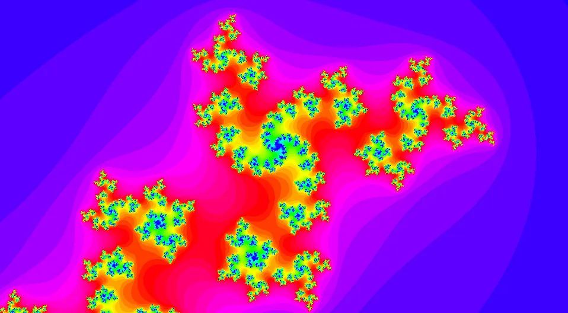

# frax

 a realtime Julia fractals explorer made with Go and OpenGL



## Building

```sh
go build
./frax
```

You will need OpenGL and GLFW installed.

You might need to specify the C compiler/linker flags to help go find them ; for example:
```sh
export CGO_CFLAGS='-I/usr/local/include'
export CGO_LDLAGS='-L/usr/local/lib'
go build
```

For more informations, please refer to the Go binding libraries:
[go-gl/gl](https://github.com/go-gl/gl)
and
[go-gl/glfw](https://github.com/go-gl/glfw)

## How-to

Use the mouse to naviage, and the Up/Down arrows to change the contrast.

Note: the higher the contrast, the higher the number of iterations used for the escape analysis, which means an higher load on your GPU.
